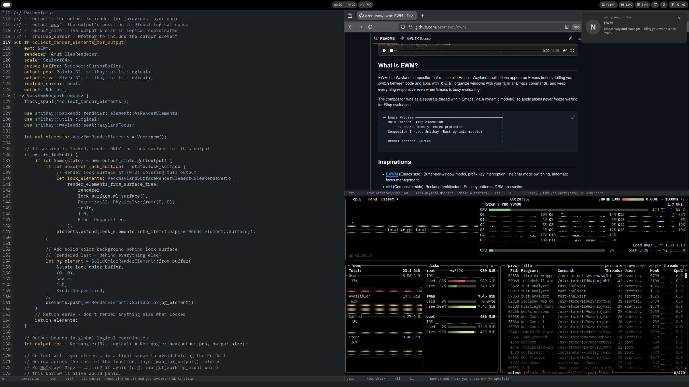

# EWM - Emacs Wayland Manager



> **Disclaimer**: Writing a Wayland compositor from scratch is a staggering amount of work. I wanted to switch from EXWM as soon as possible, so the initial bootstrap was done with Claude, which helped a lot in reverse-engineering the brilliant [niri](https://github.com/YaLTeR/niri) codebase and surgically extracting the pieces relevant to EWM. Inherently, this means the codebase still needs validation and cleanup, which is the current priority.

## What is EWM?

EWM is a Wayland compositor that runs inside Emacs. Wayland applications appear as Emacs buffers, letting you switch between code and apps with `C-x b`, organize windows with your familiar Emacs commands, and keep everything responsive even when Emacs is busy evaluating.

The compositor runs as a separate thread within Emacs (via a dynamic module), so applications never freeze waiting for Elisp evaluation.

```
┌─ Emacs Process ────────────────────────────────────────────┐
│  Main Thread: Elisp execution                              │
│       ↑↓ shared memory, mutex-protected                    │
│  Compositor Thread: Smithay (Rust dynamic module)          │
│       ↑↓                                                   │
│  Render Thread: DRM/GPU                                    │
└────────────────────────────────────────────────────────────┘
```

## Quick Start

```bash
cd compositor && cargo build --features=screencast
EWM_MODULE_PATH=$(pwd)/target/debug/libewm_core.so \
  emacs --fg-daemon -L ../lisp -l ewm -f ewm-start-module
```

Launch apps with `s-d`. See the [wiki](https://codeberg.org/ezemtsov/ewm/wiki) for full setup, configuration, and NixOS instructions.

## Current Features

- Wayland surfaces as Emacs buffers
- Automatic layout synchronization
- Per-output declarative layout (surfaces can span multiple outputs)
- Per-window fullscreen (XDG fullscreen protocol, `s-f` toggle)
- Prefix key interception (compositor forwards to Emacs)
- Client-side decoration auto-disable
- DRM backend with multi-monitor support (hotplug, per-output Emacs frames)
- Lid close/open handling (laptop panel off when external monitor connected)
- Layer-shell protocol (waybar, notifications, etc.)
- Workspace protocol (ext-workspace-v1, tab-bar integration)
- Screen sharing via xdg-desktop-portal (PipeWire DMA-BUF)
- Input method support (type in any script via Emacs input methods)
- Clipboard integration with Emacs kill-ring as central hub
- Screen locking via ext-session-lock-v1 (swaylock)
- Idle notification via ext-idle-notify-v1 (swayidle)
- XDG activation (focus requests from apps)
- Fractional output scaling (1.25x, 1.5x, etc.)

## Known Limitations

- GPU selection is automatic (no override)
- Must run from TTY (no nested mode)

## Inspirations

- **[EXWM](https://github.com/ch11ng/exwm)** (Emacs side): Buffer-per-window model, prefix key interception, automatic focus management
- **[niri](https://github.com/YaLTeR/niri)** (Compositor side): Backend architecture, Smithay patterns, DRM abstraction

## License

GPL-3.0
