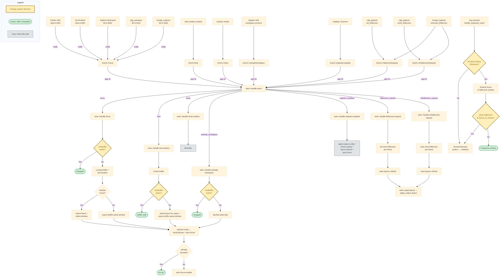

# EWM Focus Design

## Overview

EWM has a unique focus model that bridges Wayland compositor focus with Emacs frame/window focus. The compositor manages keyboard focus for surfaces while coordinating with Emacs to ensure a consistent user experience.

## Key Concepts

### Surface Types

1. **Emacs surfaces** (`emacs_surfaces`): Frames belonging to the Emacs process. Identified by matching PID.
2. **External surfaces**: Windows from other applications (Firefox, terminals, etc.)

### Focus States

- **Compositor focus** (`focused_surface_id`): Which surface has keyboard focus at the Wayland level
- **Emacs focus**: Which frame/window is selected in Emacs
- **Pointer location**: Current mouse position (tracked separately from focus)

## Focus Behaviors

### Input-to-Focus

Any input action (click OR scroll) focuses the surface under the pointer:
1. Compositor calls `set_focus(id, true, "click"/"scroll", None)`
2. Always sends `Focus { id }` event to Emacs (no deduplication by ID)
3. Emacs finds the correct window for that surface and selects it

Sending Focus on every click/scroll (even when `id == focused_surface_id`) is
essential for multi-window surfaces: the same surface may be visible in multiple
Emacs windows, so Emacs needs the event to select the window under the pointer.

This unified model means:
- Scrolling a surface focuses it (keyboard focus follows)
- Clicking a surface focuses it
- Mere hover without input does NOT change focus

### Intercepted Keys (Super-key bindings)

When a Super-key binding is pressed while focus is on an external surface:
1. Compositor intercepts the key (doesn't forward to surface)
2. Finds the Emacs frame on the **same output as the focused surface** (via `focused_output_for_surface()`)
3. Switches keyboard focus to that Emacs frame
4. Forwards the key to Emacs

Because scroll updates focus, the focused surface is always where the user last interacted, ensuring intercepted keys route to the correct Emacs frame.

### Prefix Key Sequences

When a prefix key (C-x, C-h, M-x) is intercepted from an external app, focus
must stay on Emacs until the key sequence completes. Without this, popups like
which-key would appear but the user couldn't interact with them.

#### The Problem

EXWM solves this with X11 keyboard grabbing - during a prefix sequence, ALL keys
go to Emacs regardless of focus. Wayland doesn't have an equivalent mechanism.

Without special handling:
1. User presses C-x in Firefox
2. Compositor intercepts, redirects to Emacs
3. which-key popup appears (triggers `window-configuration-change-hook`)
4. Hook calls `ewm-layout--refresh`, which syncs focus back to Firefox
5. User's next keypress goes to Firefox instead of completing the sequence

#### Solution: Compositor-side Prefix Tracking

During initialization, Emacs tells the compositor which intercepted keys are
prefix keys (bound to keymaps). The compositor uses this to track state:

```
Initialization:
  Emacs scans keymaps → sends intercept specs with :is-prefix flag

Runtime:
  Prefix key intercepted → compositor sets IN_PREFIX_SEQUENCE=true
  post-command-hook fires → ewm-input--clear-prefix clears flag → syncs focus
```

Key insight: Compositor only SETS the flag true on prefix keys, never clears it.
`ewm-input--clear-prefix` (called synchronously from `post-command-hook`) clears
the flag and calls `ewm--sync-focus` to restore focus to the pre-intercept surface.

#### Implementation

**Rust side:**
- `InterceptedKey.is_prefix` - marks prefix keys
- `IN_PREFIX_SEQUENCE: AtomicBool` - the tracking flag
- `ewm-in-prefix-sequence-p` - Emacs queries the flag
- `ewm-clear-prefix-sequence` - Emacs clears the flag

**Elisp side:**
- `ewm--event-to-intercept-spec` adds `:is-prefix` based on `(keymapp (key-binding ...))`
- `ewm--focus-target` computes the surface ID that should have focus, returning
  `nil` to suppress sync during prefix sequences, prefix args, or transient maps.
- `ewm--minibuffer-active-p` guards event handlers that must not steal focus from
  the minibuffer (Focus, New surface, ActivateWorkspace).

Focus suppression in `ewm--focus-target`:

```elisp
(cond
 ((or prefix-arg
      (ewm-in-prefix-sequence-p)
      (and overriding-terminal-local-map
           (keymapp overriding-terminal-local-map)))
  nil)  ; suppress — don't change focus
 ((ewm--minibuffer-active-p)
  (frame-parameter (selected-frame) 'ewm-surface-id))
 (t
  (or (buffer-local-value 'ewm-surface-id ...)
      (frame-parameter (selected-frame) 'ewm-surface-id))))
```

#### Critical Design Decisions

1. **Don't clear flag on non-prefix intercepts**: If user presses C-x then s-left
   (an intercepted non-prefix key), the flag must stay true. Only
   `post-command-hook` (after the full command completes) clears it.

2. **Synchronous focus sync**: `ewm-input--clear-prefix` runs directly from
   `post-command-hook` — no timer or debouncing. This works because
   `post-command-hook` only fires after complete commands, not mid-sequence.
   Layout sync is decoupled via `window-selection-change-functions`.

3. **Only clear when active**: `ewm-input--clear-prefix` only acts when
   `ewm-in-prefix-sequence-p` is true. It clears the flag and calls
   `ewm--sync-focus` to restore focus. When no prefix sequence is active,
   it's a no-op — other hooks handle normal focus changes.

### Frame-Switch Suppression

PGTK's `pgtk_focus_frame` updates GDK state when `select-frame` is called
(in `ewm--handle-focus`), generating `handle-switch-frame` events that target
the wrong frame in multi-output setups. This overrides compositor click-to-focus.

Fix: suppress `handle-switch-frame` via `:around` advice when EWM is active.
Same pattern as EXWM suppressing `handle-focus-in`/`handle-focus-out`
(exwm-workspace.el).

### Mouse-Follows-Focus

When `ewm-mouse-follows-focus` is enabled, the pointer warps to the center of a
window when it gains focus via keyboard (e.g., `C-x o`, windmove). This ensures
the pointer is always in the active window for subsequent mouse interactions.

The implementation includes a pointer-in-window check inspired by
[exwm-mff](https://codeberg.org/emacs-weirdware/exwm-mff): if the pointer is
already inside the target window, no warp occurs. This prevents unnecessary
pointer jumps when keyboard-switching to a window the mouse happens to be over.

Key functions:
- `ewm-input--pointer-in-window-p`: Checks if pointer is within window bounds
- `ewm-input--warp-pointer-to-window`: Warps pointer to window center (if needed)
- `ewm-get-pointer-location`: Queries compositor for current pointer position

### Why Input-to-Focus?

Previous design had keyboard focus only change on click. This caused issues:
- User scrolls Firefox on external monitor
- User presses M-x
- M-x would route to primary monitor (last clicked) instead of external

With input-to-focus:
- Scroll Firefox → Firefox has focus, external monitor is "active"
- Press M-x → routes to Emacs frame on external monitor

## Module Events

Events are serialized to JSON and delivered to Emacs via pipe fd:

| Event | When Sent | Purpose |
|-------|-----------|---------|
| `ready` | Compositor fully initialized | Signal Emacs to begin setup |
| `new` | Surface created | Register new surface with Emacs |
| `close` | Surface destroyed | Clean up surface buffer |
| `title` | Surface title changes | Update buffer name |
| `focus` | External surface clicked/scrolled (always sent) | Tell Emacs to select the window under pointer |
| `output_detected` | Output connected | Create Emacs frame for output |
| `output_disconnected` | Output disconnected | Clean up frame |
| `outputs_complete` | All outputs reported | Trigger initial layout |
| `text-input-activated` | Text field focused in surface | Enable input method bridge |
| `text-input-deactivated` | Text field unfocused | Disable input method bridge |
| `key` | Intercepted key with UTF-8 | Forward key event to Emacs |
| `state` | Debug state requested | Populate `*ewm-state*` buffer |
| `working_area` | Layer-shell exclusive zone changes | Adjust frame geometry |

### Event Flow Diagram

The following diagram shows how compositor events flow through Emacs handlers,
including minibuffer guards that prevent focus-stealing during transient states.



Source: [refocus.mmd](diagrams/refocus.mmd)

## Functions

### Compositor (Rust)

- `set_focus(id, notify_emacs, source, context)`: Single entry point for all focus changes. Sets logical focus, marks keyboard dirty, optionally sends Focus event to Emacs. Debug source/context tracked in focus history.
- `sync_keyboard_focus()`: Resolve `focused_surface_id` → `WlSurface`, call `keyboard.set_focus()` if dirty
- `get_emacs_surface_for_focused_output()`: Find Emacs frame on same output as focused surface

### Emacs (ewm.el / ewm-input.el / ewm-layout.el)

- `ewm-focus(id)`: Request compositor to focus a surface (ModuleCommand::Focus)
- `ewm--handle-focus(event)`: Handle Focus event from compositor. Guarded by `ewm--minibuffer-active-p`. Finds the correct window using `ewm-input--pointer-in-window-p` when multiple windows show the same buffer. Falls back to `pop-to-buffer-same-window` when no window displays the buffer.
- `ewm--sync-focus`: Computes focus target via `ewm--focus-target`, deduplicates against current compositor focus, sends `ewm-focus` only when changed. Called from window/buffer change hooks and `ewm-input--clear-prefix`.
- `ewm-input--clear-prefix`: `post-command-hook` handler. Only acts during prefix sequences: clears flag, calls `ewm--sync-focus` to restore focus. No-op otherwise.
- `ewm-input--suppress-switch-frame`: `:around` advice on `handle-switch-frame`. Suppresses it when `ewm--module-mode` is active — EWM owns frame selection.
- `ewm--focus-target`: Returns target surface ID, or nil to suppress sync during prefix sequences, prefix args, or transient keymaps. During minibuffer, returns the frame's surface ID.
- `ewm--minibuffer-active-p`: Guard used by event handlers (Focus, New surface, ActivateWorkspace) to prevent focus-stealing from minibuffer.
- `ewm--on-window-selection-change`: `window-selection-change-functions` handler, sends layouts and syncs focus whenever selected window changes.

Note: Focus sync and layout sync are coupled in `ewm--on-window-selection-change`
(calls both `ewm-layout--send-layouts` and `ewm--sync-focus`) but can also fire
independently — `ewm-input--clear-prefix` syncs focus without sending layouts,
and `ewm--window-config-change` sends layouts without syncing focus.

## Multi-Monitor Behavior

Each output typically has one Emacs frame. When the pointer moves between outputs:
- Scroll/hover work on surfaces under the pointer
- Intercepted keys route to the Emacs frame on that output
- Click focus updates `focused_surface_id`

## Design Rationale

The input-to-focus model was chosen over alternatives:

1. **Click-only focus + pointer-based key routing**: More complex, requires tracking both focus and pointer location for routing decisions.

2. **Full focus-follows-mouse (hover = focus)**: Too aggressive, causes focus changes during casual mouse movement.

3. **Input-to-focus (current)**: Simple unified model where any interaction (click or scroll) activates that location. Matches user intent: "I'm interacting here, so this is active."

## Multi-Window Surface Focus

A single surface (e.g., Firefox) can be displayed in multiple Emacs windows
simultaneously (e.g., visible on two monitors). This creates a challenge:
`focused_surface_id` is the same regardless of which window the user clicks.

### Compositor Side

Click and scroll handlers call `set_focus(id, true, "click"/"scroll", None)` on
every interaction, even when `id == focused_surface_id`. This ensures Emacs
always receives a Focus event and can select the correct window.

### Emacs Side

`ewm--handle-focus` resolves the Focus event to the correct Emacs window:

1. Get all windows showing the surface's buffer via `get-buffer-window-list`
2. Use `ewm-input--pointer-in-window-p` to find the window under the pointer
3. Fall back to `get-buffer-window` if no pointer match (e.g., programmatic focus)

### Focused and Primary Flags

Each layout entry has two independent flags:

**`focused`** (Emacs → compositor): Marks the entry for `selected-window`. Set by
Emacs in `ewm-layout--send-layouts`. Used for **output association** — focus
routing, intercept redirect, popup placement. The compositor uses
`focused_output_for_surface()` to find the output where the user is interacting.

**`primary`** (compositor-computed): Marks the entry with the largest pixel area
for a given surface across all outputs. Computed in `apply_output_layout` step 7
by scanning all `output_layouts`. Used for **configure and rendering** — only
primary entries send `send_configure()` with their size + scale; primary entries
render at native size (with crop for client min-size overflow); non-primary
entries use uniform fill+crop preserving aspect ratio.

These flags are independent because the selected window is not necessarily the
largest. For example, Firefox may be focused in a small sidebar on eDP-1 but
have its primary (largest) view on DP-2. Focus routing must go to eDP-1 (where
the user is working), while configure must use DP-2's dimensions (the largest
area for rendering).

Layout updates (including focused flags) are triggered by
`window-selection-change-functions`, which fires whenever `selected-window`
changes — regardless of whether the change came from keyboard navigation,
click-to-focus, or programmatic selection.

## Layout Synchronization

### Per-Output Declarative Layout

Emacs sends one `OutputLayout` command per output — a complete declaration of
what's visible on that output with frame-relative coordinates. The compositor
materializes it via `apply_output_layout`, which is the single entry point for
positioning, output association, and scale notification.

```
Emacs                          │  Compositor
                               │
ewm-layout--refresh            │
  └─ compute layout per output │
  └─ ewm-output-layout ───────►│  apply_output_layout(output, entries)
                               │    ├─ diff old vs new surface sets
                               │    ├─ output.enter/leave as needed
                               │    ├─ send scale/transform
                               │    ├─ compute primary flags (largest area)
                               │    ├─ configure primary surfaces
                               │    └─ queue_redraw(&output)
```

Each `OutputLayout` replaces the previous layout for that output. The compositor
diffs surface ID sets to send `wl_surface.enter`/`leave` incrementally.

### Deduplication

Click/scroll `Focus` events are **not** deduplicated — they always notify Emacs,
because the same surface ID may appear in multiple Emacs windows and Emacs needs
the event to select the correct one.

`ModuleCommand::Focus` (from Emacs) still deduplicates by ID in the fixture/test
path to avoid redundant focus changes.

`TextInputIntercept` deduplicates:

| Command | Cache Key | Skip Condition |
|---------|-----------|----------------|
| `TextInputIntercept` | global | `state == cached_state` |

## Keyboard Focus Synchronization

### The Two Levels of Focus

EWM tracks focus at two levels that must stay in sync:

1. **Logical focus** (`focused_surface_id`): The compositor's idea of which surface
   should have input. Updated by clicks, scrolls, xdg_activation, Emacs commands.
2. **Wayland keyboard focus** (`keyboard.set_focus()`): The actual Wayland protocol
   state that determines which surface receives key events.

A bug where these diverge is invisible — the surface appears focused (renders with
focus decorations, Emacs shows its buffer) but keyboard input goes elsewhere.

### Comparison with Niri

[Niri](https://github.com/YaLTeR/niri) uses a fully deferred focus model:

```
Any focus trigger              refresh() (main loop)
  activate_window() ──────►  update_keyboard_focus()
  layout state changes           │
  queue_redraw_all()             ├─ compute focus from layout state
                                 ├─ compare with current
                                 └─ keyboard.set_focus() ← ONLY CALL SITE
```

- `keyboard.set_focus()` is called in exactly **1 function** (`update_keyboard_focus`)
- That function is called from exactly **1 place** (`refresh()` in the main loop)
- All focus triggers (clicks, activation, keybinds) just update layout state
- Keyboard focus syncs on the next refresh cycle

This is robust: impossible to forget a `keyboard.set_focus()` call, and focus
naturally settles after all state changes complete (e.g., surface replacement).

### Why EWM Cannot Fully Defer

EWM's `intercept_redirect` path requires **atomic focus + key forwarding**:

1. User presses `C-x` while Firefox has focus
2. Compositor intercepts the key (not forwarded to Firefox)
3. Must set Wayland keyboard focus to Emacs **immediately**
4. Must re-send the key to Emacs **in the same handler**

If step 3 were deferred to a refresh cycle, the key in step 4 would be sent to
whatever surface currently has Wayland keyboard focus (still Firefox), not Emacs.

Niri doesn't have this constraint because its intercepted keybinds execute
compositor-internal actions. EWM forwards intercepted keys to a client (Emacs),
which requires the focus change to happen first.

A second constraint is **layout ownership**. Niri's `update_keyboard_focus()`
recomputes focus from scratch each cycle because the compositor owns the full
layout state. In EWM, layout lives in Emacs — the compositor only knows
`focused_surface_id`. It cannot derive "who should have focus" from layout state;
it must track focus incrementally.

### Desired Architecture: Hybrid Model

```
                            ┌──────────────────────────────┐
                            │    focused_surface_id        │
                            │    (single source of truth)  │
                            └──────────┬───────────────────┘
                                       │
              ┌────────────────────────┼─────────────────────────┐
              │ DEFERRED PATH          │  IMMEDIATE PATH         │
              │                        │                         │
              │  xdg_activation        │  intercept_redirect     │
              │  ModuleCommand::Focus  │   (must set focus +     │
              │  toplevel_destroyed    │    re-send key in same  │
              │                        │    handler)             │
              │                        │                         │
              │                        │  click / scroll         │
              │                        │   (always notify Emacs  │
              │                        │    for multi-window)    │
              │                        │                         │
              │  Set focused_surface_id│  Set focused_surface_id │
              │  Set keyboard_focus    │  Set keyboard_focus     │
              │  Set dirty flag ───┐   │  keyboard.set_focus()   │
              │                    │   │  Clear dirty flag       │
              │                    ▼   │                         │
              │         ┌──────────────┴──┐                      │
              │         │sync_kbd_focus() │                      │
              │         │                 │                      │
              │         │ if dirty:       │                      │
              │         │   resolve id    │                      │
              │         │   → WlSurface   │                      │
              │         │   kbd.set_focus │                      │
              │         │   dirty = false │                      │
              │         └─────────────────┘                      │
              │            Called from:                           │
              │            • handle_keyboard_event (top)         │
              │            • after ModuleCommand batch           │
              │            • main loop tick                      │
              └──────────────────────────────────────────────────┘
```

**Deferred path**: Most focus changes set `focused_surface_id` + dirty flag.
The `sync_keyboard_focus()` function resolves the ID to a `WlSurface` and calls
`keyboard.set_focus()`. This catches missed syncs and handles surface replacement
(e.g., Firefox surface 2 → 3) naturally.

**Immediate path**: Only `intercept_redirect` calls `keyboard.set_focus()`
directly, because it must forward the key in the same handler. It also clears the
dirty flag to prevent a redundant sync.

### Benefits

1. **Eliminates "forgot to sync" bugs**: New focus-changing code paths only need
   to set `focused_surface_id` and mark dirty. The sync function handles the rest.
2. **Handles surface replacement**: If a surface is replaced between focus change
   and sync, the sync resolves the current `focused_surface_id` (which Emacs has
   already updated) to the correct `WlSurface`.
3. **Auditable**: Only 2 call sites for `keyboard.set_focus()` (sync function +
   intercept_redirect), down from 13.

### Why Emacs Must Own Layout

Niri can recompute focus from layout state because the compositor owns the full
layout: workspace assignments, column ordering, window stacking. Could EWM move
layout ownership to the compositor for the same robustness?

No — Emacs IS the layout engine:

1. **Window tree**: Emacs's window tree (splits, sizing, ordering) is the layout.
   Reimplementing `split-window`, `balance-windows`, `display-buffer-alist` in
   the compositor would duplicate Emacs's window manager without gaining anything.

2. **Buffer ↔ surface mapping**: Emacs decides which buffer shows in which window
   via `display-buffer-alist`, `pop-to-buffer`, dedicated windows, etc. This
   mapping is deeply integrated with user configuration.

3. **Tabs**: `tab-bar-mode` multiplexes window configurations. The compositor
   cannot know which surfaces belong to which tab without Emacs telling it.

4. **User customization**: Users customize layout via Elisp (hooks, advices,
   `display-buffer-alist` rules). Moving layout to the compositor would require
   a new configuration language for something Elisp already handles well.

The current model — Emacs owns layout, compositor owns rendering and input —
matches the natural boundary. The hybrid keyboard focus sync (deferred + dirty
flag) provides robustness without requiring the compositor to understand layout.

## Session Lock (ext-session-lock-v1)

### Design Principle: Lock as a Mode

Session lock is a **global mode** that overrides normal compositor behavior. It is
NOT a special surface type — it's a state that changes how every subsystem operates.
Every subsystem must check lock state at its entry point and branch early, rather
than sprinkling lock checks throughout normal logic.

Reference: [niri](https://github.com/YaLTeR/niri) treats lock as a priority branch
in `update_keyboard_focus()`, `commit()`, rendering, and input — the same pattern
EWM follows.

### State Machine

```
LockState::Unlocked ──lock()──► LockState::Locking(SessionLocker)
                                       │
                          all outputs render locked frame
                                       │
                                       ▼
                                LockState::Locked(ExtSessionLockV1)
                                       │
                                   unlock()
                                       │
                                       ▼
                                LockState::Unlocked
```

`is_locked()` returns true for both `Locking` and `Locked`.

### Subsystems Affected

Lock touches **6 subsystems**. When adding lock-related features, audit all of them:

| Subsystem | Entry point | Lock behavior |
|-----------|-------------|---------------|
| **Focus resolution** | `sync_keyboard_focus()` | Priority branch: resolve to `lock_surface_focus()` |
| **Keyboard input** | `handle_keyboard_event()` | Block all keys except VT switch; forward to lock surface |
| **Pointer input** | `handle_pointer_motion/button/scroll` | Route to lock surface; skip click/scroll-to-focus |
| **Rendering** | `collect_render_elements()` | Early return: render only lock surface + background |
| **Surface commits** | `CompositorHandler::commit()` | Queue redraw for lock surface commits (not in `space.elements()`) |
| **Frame completion** | DRM `queue_frame` | Track `LockRenderState` per-output; confirm lock when all rendered |

### Focus During Lock

Lock surface focus follows the **deferred path** via `sync_keyboard_focus()`:

```
new_surface() stores lock surface
  → sets keyboard_focus_dirty = true
  → sync_keyboard_focus() runs on next tick
  → is_locked() = true → resolve to lock_surface_focus()
  → keyboard.set_focus(lock_surface)
```

The input handler (`input.rs`) also sets focus directly on each key event as a
**redundant immediate path** — this handles the race where keys arrive before the
first sync tick. Both paths set the same target (lock surface), so they don't
conflict.

### Unlock Focus Restoration

On unlock:
1. `keyboard_focus` is cleared to `None` (invalidates stale tracking)
2. `pre_lock_focus` is restored via `set_focus()`
3. `sync_keyboard_focus()` resolves the restored ID to a `WlSurface`

Step 1 is critical: during lock, the input handler's direct `keyboard.set_focus()`
calls don't update the tracked `keyboard_focus` field. Without clearing it, the
sync function would see `keyboard_focus == restored_focus` (stale value from
pre-lock) and skip the actual `keyboard.set_focus()` call, leaving Smithay's
internal keyboard state pointing at the destroyed lock surface.

### Per-Output State

Each output tracks independently:
- `lock_surface: Option<LockSurface>` — the lock surface for this output
- `lock_render_state: LockRenderState` — whether a locked frame has been rendered

Lock is confirmed (`Locking` → `Locked`) only when ALL outputs have
`lock_render_state == Locked`. This prevents briefly showing unlocked content
on a slow output.

### Commit Handler: Surface Type Dispatch

`CompositorHandler::commit()` dispatches by surface type in this order:
1. **Layer surfaces** — `handle_layer_surface_commit()` (early return)
2. **Popups** — `popups.commit()` + initial configure
3. **Windows** — `space.elements()` lookup → `on_commit()` + redraw
4. **Lock surfaces** — `is_locked()` + output scan → redraw

If adding a new surface type, it must be added to this dispatch chain.
Lock surfaces need special handling because they aren't tracked in
`space.elements()` — they're stored per-output in `OutputState`.
